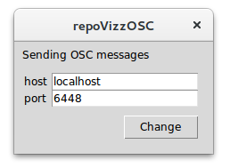

Repovizz player to OSC
======================

This software adds to repovizz the feature to send the played streams to 3rd party
software using OSC. The principle is very simple:

repovizz in browser --(websocket)--> repoVizzOSC --(OSC)--> 3rd Party software

The default settings (port) are designed to match [Wekinator](http://www.wekinator.org/)'s.

**Author/contact**: carles.fernandez@upf.edu



Setup
-----

You can use a [pre-compiled binary](https://github.com/chaosct/repovizzOSC/releases) instead.

From source:


```
# virtualenv stuff (optional)
$ virtualenv env
$ . env/bin/activate

# installing libraries
(env)$ pip install -r requirements.txt

# running the server
(env)$ python repoVizzOSC.py #with GUI
(env)$ python repoVizzOSC.py --cli #without GUI
```


Usage
-----

Open your browser to http://repovizz.upf.edu and use repovizz as usual.
When inside a datapack, add some signals to the canvases. When you play them (pressing space),
the data is sent to the server and then as OSC messages to `localhost:6448` with the address `/repovizz`
and the signals' values as arguments.

To send parts of the recording, select a part of the timeline (`b` key: begin, `e` key: end),
and press `o` key to send the bulk of messages.

License
-------

    Copyright (C) 2016  repoVizz

    This program is free software: you can redistribute it and/or modify
    it under the terms of the GNU Affero General Public License as
    published by the Free Software Foundation, either version 3 of the
    License, or (at your option) any later version.

    This program is distributed in the hope that it will be useful,
    but WITHOUT ANY WARRANTY; without even the implied warranty of
    MERCHANTABILITY or FITNESS FOR A PARTICULAR PURPOSE.  See the
    GNU Affero General Public License for more details.

    You should have received a copy of the GNU Affero General Public License
    along with this program.  If not, see <http://www.gnu.org/licenses/>.
